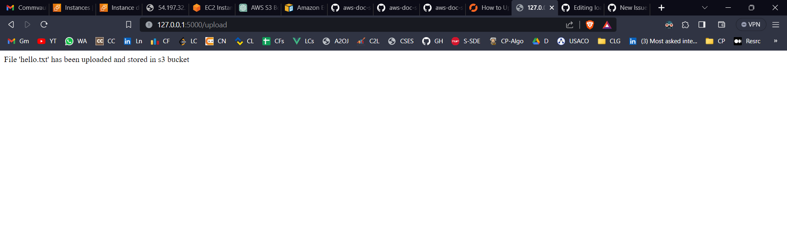
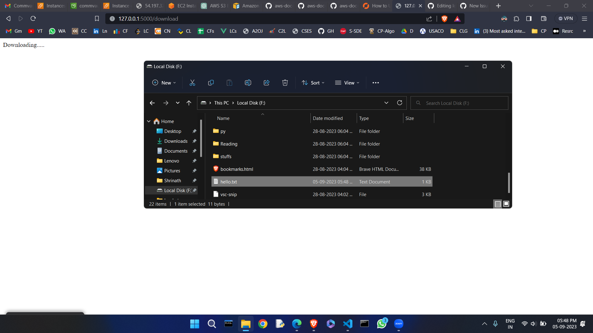
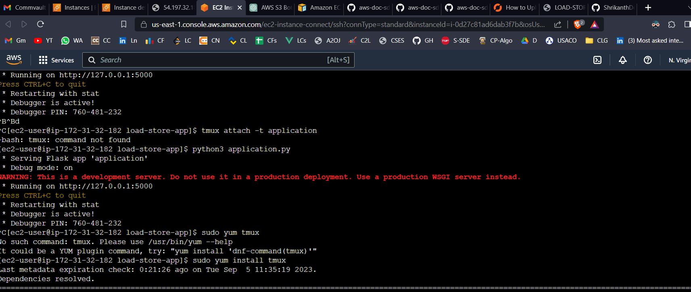

# Load-Store-Application using boto3

+ This is a flask based application for load and storing the documents to the s3 bucket

## STEPS DONE:
+ created a AWS root user account
+ created IAM role for commvault-interview process with minimal roles  ( ec2& s3)
+ created Access key
+ created ec2-key pair
+ boto3 python program to launch an ec2 instance using the credentials
+ created a flask app:
  + 3 functionality -> search, download, upload
  + 3 templates for the same
+ uploaded the flask prgm to github
+ ssh into the ec2 instance and performed the basic scripts
+ fetched the flask prgm from github repo
+ runned the program on the ec2 instance
# working appln in my local machine
### home page 

### upload page

### search page

+ FOUND CASE

+ NOT FOUND CASE

### Download page

+ FOUND CASE

+ NOT FOUND CASE

### EC2 INSTANCE

### S3 BUCKET

### IAM USER FOR seprate user not using root user for confidential purpose

# DEPLOYMENT
+ could locally run the application on the ec2 instance but not deploy it
